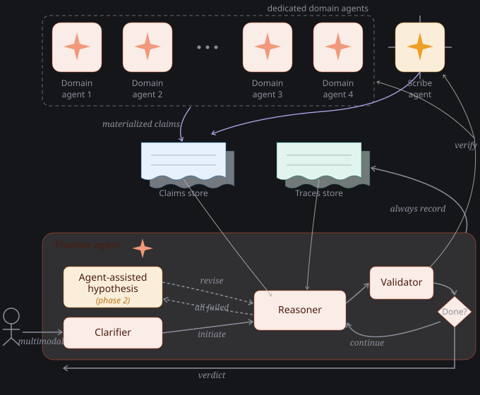

# Architecture

The system diagnoses "why didn't X happen as expected?" over heterogeneous business facts, and shows its work as a cited causal chain. It is organized in three bands: **agents** (top), **stores** (middle), and the **planner** (bottom).

## Domain agents

A domain agent owns one slice of a domain and knows how to answer questions about it. Take a **production line** as the running example: a *line-telemetry agent* owns the structured telemetry of the assembly lines — throughput, station cycle times, stoppages, sensor readings.

Each domain agent is self-contained and can carry:

- its own **structured store** (the source system it reads — e.g. the telemetry historian)
- its own **knowledge base** and **RAGs** over domain material
- its own **tools** and **MCP servers** for live lookups and actions
- an **asynchronous ingestion path** — any domain expert can add knowledge (playbooks, past root causes, notes) to the agent's KB at any time, independent of any investigation

Structured line telemetry is *a domain*; orders, schedule, inventory, quality, deploys are other domains, each with its own agent.

## Scribe agent

The **Scribe** is the one agent that is not tied to a domain. It covers the loose corporate information store — email, Slack, floor notes, tickets — the human signal that doesn't belong to any single system of record. Where a domain agent reads structured facts, the Scribe reads prose and turns it into claims.

## Claims

A **claim** is a materialized understanding of a single granular fact, produced by an agent from the domain data, KB, and MCP tools at its disposal.

- Claims are minted **in context**: the Validator asks an agent to verify something, and while verifying, the agent concludes one or more domain-local facts.
- Those facts are written to the **Claims store** and are available to the rest of the investigation.
- They also persist for future investigations — the store accretes; nothing is overwritten.

## Planner

The planner runs one investigation. It has four parts.

### Clarifier

A **multimodal, iterative chat** that makes sure the question is understood. It accepts text and images and goes back and forth with the user as needed. The demarcation is sharp: **when the Clarifier finishes, the investigation objective is clear.** Everything downstream works from that clarified question.

### Reasoner

The Reasoner takes the clarified question and queries the **Claims store**, pulling whatever it judges relevant given its reading of the question and the possible explanations. From those claims it forms either:

- a **hypothesis** — a candidate explanation that the current claims *point at* but do not settle, or
- a **proof** — a conclusion the current claims *already establish*.

### Validator

The Validator takes a hypothesis together with the claims the Reasoner formed it on, and seeks confirmation. It dispatches the domain agents and the Scribe (`verify`) to look in the world; they return **new claims**, and on that enriched evidence the Validator concludes.

- If the Reasoner produced a **proof** rather than a hypothesis, there is nothing to look up — the Validator trivially passes it through without calling any agent.
- The `Done?` decision then either **continues** the loop (form the next link) or ends it.

### Traces store

Every completed investigation — the reasoning and its verdict — is written to the **Traces store** (`always record`). All final investigations enter the Traces store; it is the planner's durable record of what it did.

## A worked example

A factory runs assembly lines. Order 1052 was supposed to be built on Line 3 and finished by the 19th. It's the 22nd and the order was never even assigned to the line. **Why?**

### The clarified question

The user might ask this messily ("why didn't 1052 run?"). The **Clarifier** pins it down to a clear objective: *Order 1052 was expected on Line 3 by the 19th; it's unassigned; explain the deviation.* Everything downstream works from this.

### What's in the Claims store at the start

Very little. Just the deviation itself:

- Order 1052 was committed to Line 3, due the 19th
- As of the 22nd, it's still unassigned

These are already in the store because a *previous* investigation put them there — the store is shared and accretes across investigations, so a new investigation often starts with a few relevant claims already on hand. But it does **not** yet contain the facts that would explain *why* — nobody has looked. This is the key point: the Reasoner reasons from a *thin* picture.

### The Reasoner forms hypotheses

From that thin picture, the **Reasoner** can't deduce a cause — so it forms three candidate explanations (things to check, not conclusions):

1. Line 3 was genuinely down, so nothing could run on it
2. A higher-priority order took Line 3
3. The scheduler was told Line 3 was unavailable — but that information was wrong

None of these is decidable from what's in the store. Each needs an agent to go look. *(If the Reasoner had instead found the claims already settled the matter, it would produce a **proof** and skip straight to the verdict — no agents called.)*

### The Validator checks them, one by one

The **Validator** takes each hypothesis and dispatches the right agent to fetch evidence. The agents mint **new claims** as they go — which is where the store gets filled.

**Hypothesis 1 — Line 3 was down.**
Validator asks the *Scheduler agent*: was Line 3 running? It returns new claims: Line 3's maintenance ran from 17th 3pm to 17th 6pm, and the line sat idle for four days after. So the line was **up and free** the whole time. -> **Ruled out.**

**Hypothesis 2 — a higher-priority order took the line.**
Validator asks the *Line planner agent*: did anything else run on Line 3? New claim: nothing ran on Line 3 in the window. -> **Ruled out.**

**Hypothesis 3 — the scheduler acted on wrong information.**
Validator asks the *Scheduler agent* and the *Scribe agent*. New claims come back: a floor note said "Line 3 is down for maintenance" — but that note was **written on the 18th**, describing a maintenance window that had **already closed the night before**. The scheduler read that stale note on the morning of the 18th and dropped Line 3 from the pool. -> **Confirmed.**

### The winner

Hypothesis 3 is the only one left standing, backed by real claims. The verdict: *the line was free; the information was stale.* The scheduler did nothing wrong except act on a note that was true when written and out of date when used.

### Updated Claims store

As the agents worked through each hypothesis, they wrote everything they found back to the store — including the facts that killed the dead-end hypotheses. The store only ever grows (append-only), so after this investigation it holds all of it:

- Order 1052 was committed to Line 3, due the 19th  *// from a previous investigation*
- As of the 22nd, it's still unassigned  *// from a previous investigation*
- Line 3's maintenance ran from 17th 3pm to 17th 6pm  *// Scheduler agent · materialized from source*
- Line 3 sat idle the 18th–22nd  *// Scheduler agent · materialized from source*
- Nothing else ran on Line 3 in the window  *// Line planner agent · materialized from source*
- A floor note said "Line 3 down for maintenance," written the 18th  *// Scribe agent · materialized from source*
- The note's maintenance window had already closed the 17th  *// Scribe agent · locally derived (compared the note against the maintenance record)*
- The scheduler dropped Line 3 from the pool on the 18th, citing that note  *// Scheduler agent · materialized from source*

The next investigation that touches Line 3 or Order 1052 starts from this richer picture, not the thin one this one began with.

### Why each component was necessary

- **Two-clock claims** — the whole answer lives in the gap between when the note was *true* (the maintenance window) and when it was *written* (a day later). A store that kept only one timestamp could never find this.
- **The Reasoner** — turned a vague deviation into three concrete, checkable guesses.
- **The Validator + agents** — the explaining facts *didn't exist in the store* until agents fetched them. The Validator is what reaches into the world; the agents are what know where to look.
- **Ruling things out** — hypotheses 1 and 2 being visibly killed is half the argument. It's why the answer is convincing rather than just asserted.
- **The Traces store** — this whole investigation is now recorded. If a later investigation runs out of obvious hypotheses, the Reasoner can look back at traces like this one to derive new ones from what worked before.

## Agent-assisted hypothesis *(phase 2)*

When the Reasoner's own hypotheses are exhausted, the planner can ask the domain agents to *propose* hypotheses given the ones already ruled out, then feed those back into the loop (`revise`). This is a later-phase capability and will evolve.
